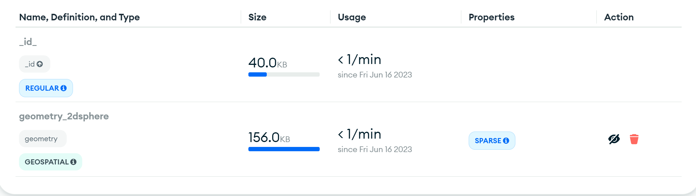
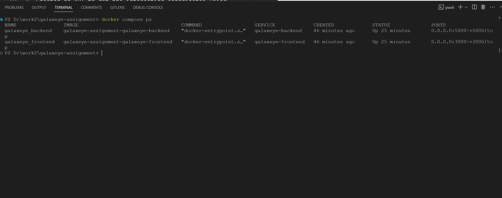

# GalaxEye Space Assignment

## GalaxEye Space Problem Statement

#### Problem Description

A user comes to a console which has a base-map and an option to draw an AOI (Area of Interest). Upon selecting and area they will be presented with all the tiles (pre configured satellite image’s metadata) which are intersecting that AOI. GalaxEye approaches you for help in developing this console. You can use any framework for this task.

#### Setting the Context

**AIM**: To create an entire full-stack website with docker compose where user can draw their AOI to see tiles which are interacting with AOI.

**Requirements**: A docker compose configuration which will spun up a react frontend, node backend and a database (Any works). Upon selecting an AOI and frontend it should pull the relative intersecting tiles from the database based on the intersection.

**Dataset for Tiles**:
[https://www.notion.so/signed/https%3A%2F%2Fs3-us-west-2.amazonaws.com%2Fsecure.notion-static.com%2F1a1e461b-4293-428d-88da-5089a8cc8cf3%2Fkarnataka.geojson?table=block&id=f5948521-192e-42a7-8802-d4ec09014796&spaceId=9301458a-f465-42d3-80eb-7c09bae15034&userId=67f0c05a-3453-4c7d-abb2-b607a18028f8&cache=v2](https://www.notion.so/signed/https%3A%2F%2Fs3-us-west-2.amazonaws.com%2Fsecure.notion-static.com%2F1a1e461b-4293-428d-88da-5089a8cc8cf3%2Fkarnataka.geojson?table=block&id=f5948521-192e-42a7-8802-d4ec09014796&spaceId=9301458a-f465-42d3-80eb-7c09bae15034&userId=67f0c05a-3453-4c7d-abb2-b607a18028f8&cache=v2)
(Can load this GeoJSON file to geojson.io to visualize how the tiles look)

**Data details**: 100 tiles covering the whole state of Karnataka.
**Output**: Tiles intersecting with the AOI shown on the frontend.

## Solution

This project allows users to draw an Area of Interest (AOI) on a base map and view the tiles intersecting with the AOI. It is built using **React** for the frontend, **Node.js/Express.js** for the backend, and **MongoDB** as the database.

### Prerequisites
Make sure you have the following installed:
* Docker: To containerize the application
* Docker Compose: To manage the multi-container application

### Getting Started
##### Installation
1. Clone the repository:
```shell
git clone https://github.com/dipakpatil1509/galaxeye-assignment.git
```
2. Navigate to the project directory:
```shell
cd galaxeye-assignment
```
##### Running the Application
1. Start the application using Docker Compose:
```shell
docker-compose up
```
It will start both servers, react and API server

2. Access the application in your web browser:
```shell
http://localhost:3000
```
### Technologies
* Frontend: React
* Backend: Node.js/Express.js
* Database: MongoDB

#### Frontend Required Packages/Tools 
1. **@reduxjs/toolkit, react-redux, redux**: To maintain global states and update states across applications for multiple components
2. **axios**: Sending requests to API
3. **leaflet, leaflet-draw, react-leaflet, react-leaflet-draw**: provides a set of components and utilities for integrating Leaflet to interact with maps, react-leaflet-draw helps us to draw over map in react
4. **tailwindcss**: CSS framework that provides a set of pre-defined utility classes

#### Backend Required Packages/Tools 
1. **cors**: Enables Cross-Origin Resource Sharing (CORS), allowing server-side code to handle requests from different origins.
2. **dotenv**: Loads environment variables from a .env file into Node.js applications, making it easy to manage configuration settings.
3. **express**:framework for Node.js that simplifies the development of APIs and web applications.
4. **mongoose**: An Object-Document Mapping (ODM) library for MongoDB and Node.js, providing a straightforward way to interact with MongoDB databases.

#### Database

We are using MongoDB(NoSQL), as database because it solves our problem to find geodata using its powerful geospatial features. We can query using coordinates to find intersecting coordinates. We can index Geospatial data in MongoDB. We are using **MongoDB Atlas Cloud Shared Clusters** for remote database.


<sub>*Sparse indexes only contain entries for documents that have the indexed field, even if the index field contains a null value. The index skips over any document that is missing the indexed field. The index is "sparse" because it does not include all documents of a collection. By contrast, non-sparse indexes contain all documents in a collection, storing null values for those documents that do not contain the indexed field.</sub>

#### How I solved the problem
1. Created a database named GalaxEyeSpace.
2. Created a collection karnataka-geo-datas to store dataset.
3. Created an API to fetch data from the given dataset and insert it in the collection, karnataka-geo-datas, which has Geospatial index on the geometry field .
4. Created an API to get the interesting coordinates using `$geoIntersects`
5. Then started developing React app, added React Leaflet to interact with maps
6. Fetched data whenever the polygon is being created, edited and deleted data when polygon is being deleted
7. Created Dockerfile for Frontend and backend server
8. Created docker compose configuration file to manage different containers

#### Images
1. Working Prototype


2. Docker Processes


#### Folder Structure with description
```
│   .gitignore 
│   docker-compose.yml (Docker compose configuration file)
│   README.md
│
├───galaxeye-backend (API folder)
│   │   .dockerignore
│   │   .env
│   │   .prettierignore
│   │   .prettierrc (Prettier configuration)
│   │   Dockerfile (Dockerfile for API)
│   │   index.ts (Start file for the node server)
│   │   package-lock.json
│   │   package.json (API node packages)
│   │   tsconfig.json
│   │
│   ├───mongo (Mongodb Schemas, Connections)
│   │   │   createModel.ts (Create Model with Typescript)
│   │   │   mongoose.ts (Mongodb connection using Monogoose)
│   │   │
│   │   ├───models
│   │   │       karnataka-geo-data.ts (Geo data model)
│   │   │
│   │   └───schemas_types
│   │           karnataka-geo-data.ts (Types for the data model)
│   │
│   └───src
│       ├───controller (Request Controller)
│       │       geolocation.controller.ts
│       │
│       ├───routes (Router files)
│       │       geolocation.routes.ts
│       │       index.routes.ts
│       │
│       ├───services (Business Logic of API)
│       │       geolocation.service.ts
│       │
│       └───utils (Helper functions)
│               helper.ts
│
└───galaxeye-frontend (Frontend/Client)
    │   .dockerignore
    │   .gitignore
    │   Dockerfile (Client Dockerfile)
    │   package-lock.json
    │   package.json (Client node package.json)
    │   README.md
    │   tailwind.config.js (Tailwind CSS Config)
    │   tsconfig.json 
    │
    ├───public (Public folder)
    │       favicon.ico
    │       index.html
    │       logo192.png
    │       logo512.png
    │       manifest.json
    │       robots.txt
    │
    └───src
        │   App.css
        │   App.test.tsx
        │   App.tsx
        │   index.css
        │   index.tsx
        │   logo.svg
        │   react-app-env.d.ts
        │   reportWebVitals.ts
        │   setupTests.ts
        │
        ├───api-handlers ()
        │       get_corresponding_tiles.handler.ts (API handler for getting tiles)
        │       request.handler.ts (Base handler to send API request)
        │       urls.ts (Endpoints)
        │
        ├───components
        │   └───Geo
        │           Geo.tsx (Geo Data Component)
        │           GeoTiles.tsx (Geo Data Corresponding tiles)
        │
        └───store (Redux Store)
            │   hooks.ts 
            │   root-reducer.ts (Root Reducer containging all reducers)
            │   store.ts (Main store initialization file)
            │
            └───geo
                    geo.slice.ts (Geo State Slice including actions and states)
                    geo.type.ts (Types of the state)
```